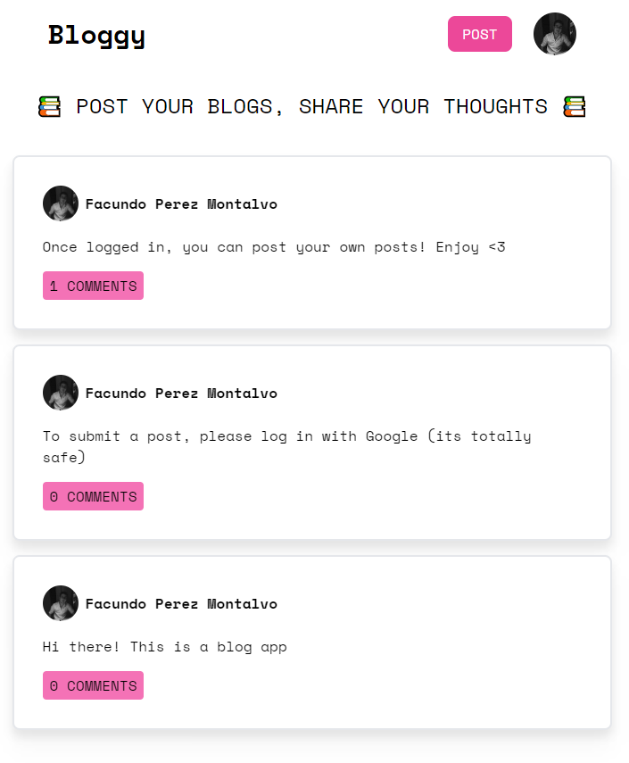

# Bloggy

Bloggy is an blog posting app

## Stack

- [Next.js](https://nextjs.org/) - A React framework with route pre-fetching, static/server side rendering
- [Tailwind CSS](https://tailwindcss.com/) - A utility first framework for styling compatible with React
- [Firebase](https://firebase.google.com/) - A backend-as-a-service used as a database

## Links

- Live site deployed on Vercel: [Deploy](https://bloggyapp.vercel.app/)

## Author

- Github Profile - [https://github.com/facuperezm](https://github.com/facuperezm)
- Twitter - [https://twitter.com/FacuPerezM](https://twitter.com/FacuPerezM)
